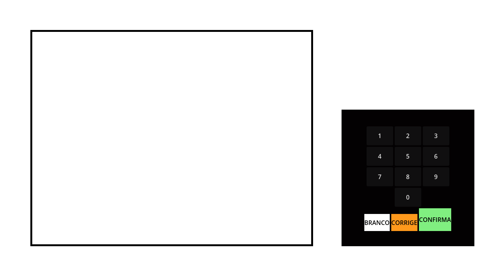

# urna-eletronica
##### Um projeto que simula a interface e o funcionamento da urna eletrônica brasileira.

## Aviso Importante!
- Esse projeto possui apenas um cunho educacional. E **não** possui qualquer vínculo com o **Governo Brasileiro** e nem com o **TSE**. **Não** sendo um meio oficial de votação.

## Sobre o desenvolvimento:
- O projeto ainda está em estágio incial de desenvolvimento.
- Muitas funcionalidades ainda estão incompletas ou não foram implementadas.
- Muitas coisas como a interface e o próprio código podem mudar ao longo do desenvolvimento.
- Alguns bugs podem ser encontrados nessa fase do desenvolvimento.

## Foto da interface principal atualmente
